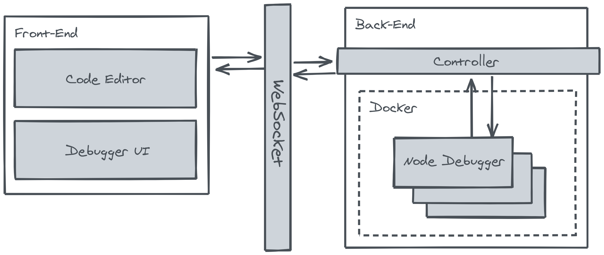

# Web-based JavaScript Step Debugger

My effort to build a web-based JavaScript step debugger. Pretty unstable now but should be enough to step through the code with variable watcher, on both global and local stack.

## Requirements

- NodeJS
- Docker

## How to run

Start the server with `npm start` command. The web UI will be running at https://localhost:3000 by default, or you can specify a different port via `PORT` environment variable.

There are two running mode:

- Automated mode: The debugger will run to completion, with the pointer stopped at every line of code.
- Manual mode: You manually step through the code.

## Architecture

The following diagram describe the high level architecture of the debugger:

Web UI will communicate with the backend via WebSocket. When the debug session start, a new Docker container will be created to run the NodeJS debugger.

Every command from the UI will be send to NodeJS debugger via WebSocket, following the [Chrome Debugging Protocol](https://chromedevtools.github.io/devtools-protocol/).
